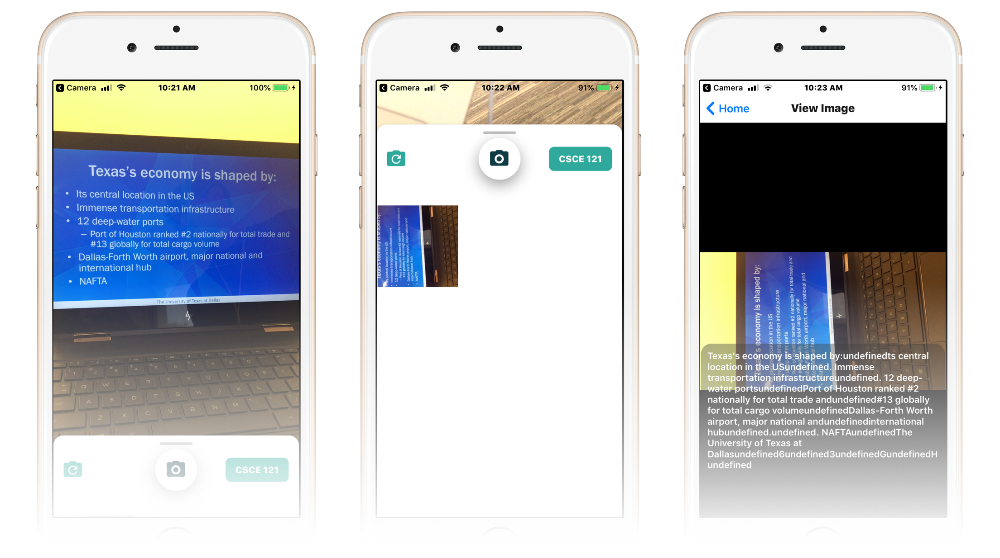

# noted
[[Source]](https://github.com/geooot/noted)  [[Website]](https://geooot.com/noted) [[Devpost]](https://devpost.com/software/noted-qnizx3) [[Slides]](/media/noted_slides.pdf)

Allows people to organize class notes pics for their classes. Made for [#tamuhack2019](https://tamuhack.com)

Won "best use of Google Cloud Plaform" award at Tamuhack 2019!



## Inspiration
Often when I open my photo gallery on my phone, I am shocked to find how many pictures are just of powerpoints and homework assignments. In the moment those photos are deemed as necessary, but when you want to just find some memories they become a huge hinderence.

The situation above is what inspired us to create noted, an app that was a camera specifically for class notes and reminders. On top of keeping note pictures away from the photo gallery, noted was designed to have features that make taking pictures of notes better. How? Taken photos will be automatically filed away to correct tags based on time of day, and photos will be transcribed using Google's Cloud Vision API allowing for the ability to search for text found in your note pictures.

## What it does
The app is very minimalistic. All you have to do is select what class you want to focus on and take a picture of notes or PowerPoint presentation. The app will immediately categorize and store the image for you and transcribe the text found on the picture.

## How we built it
We used react-native (specifically Expo) to create both an Android and iOS app. This allowed all members of the team to contribute code without having a compiler or the same OS. To share code: we used Github (and attempted good branching practices).

## Challenges we ran into
From the get go, we had to spend an immense amount of time trying to get the project set up and working for everyone. Most of us are pretty new to react-native so things like build errors, merge conflicts, and lock files gave us pretty huge headaches (George actually ended up almost dying from a headache on the first day). 

## Accomplishments that we're proud of
- Using Github to organize code
- Using Google Cloud APIs
- Actually having an app in a (somewhat) presentable state after 24hrs
  - this was actually not confiremed until about an hour before the project was due

## What we learned
- Some git fundamentals
- The ups and downs while working with react-native
- How to deal with terrible error messages
- How to keep up morale

## What's next for Noted
There is still a lot of potential ideas that can be added to this app.
Here is a few:
- Import events from the calendar to create tags
- Use timing of courses (what time of day, etc) to predict what tag the picture would belong to from before hand
- Using the keywords coming from text analysis to allow for search for text in pictures
- Importing from existing photo gallery to find older pictures of notes and categorize them into the correct tags

## Clone and get up and running

What you need first
- Install Node.JS https://nodejs.org/en/
- Yarn.JS https://yarnpkg.com/en/docs/install
- Some terminal knowlege

Installation
Clone the repo (or use Github Desktop)
```
$ git clone https://github.com/geooot/noted.git
```
Use a terminal and cd into the project folder
```
$ cd noted
```
Use yarn to install stuff
```
$ yarn install
```
Run that app yo!
```
$ yarn start
```

## Built With

* [React Native](https://facebook.github.io/react-native/) - (let us use JS to make cross-platform native apps)
* [Expo](https://expo.io/) - (allowed us not have to deal with iOS/Android SDKs)
* [Google Vision API](https://cloud.google.com/vision/) - (text detection in images through OCR)
* [GitHub](https://github.com) - (the site you are on and multi-user version control)
- Adrenaline & Caffeine (this technology probably helped the most)


## Authors
\#DreamTeam
* **George Thayamkery** - [geooot](https://github.com/geooot)
* **Ansh Jain** - [Gamebot3](https://github.com/Gamebot3)
* **Annie Paul** - [Anniep999](https://github.com/Anniep999)
* **Justin Liu** - [justinliu403](https://github.com/justinliu403)
* **Piyush Mewada** - [piyushmewada](https://github.com/piyushmewada)


## License

This project is licensed under the MIT license - see the [LICENSE.md](LICENSE.md) file for details


